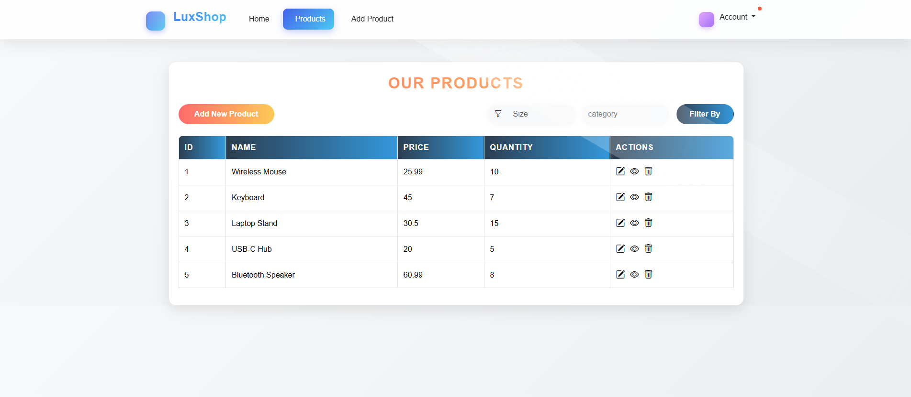

# Product-CRUD-angular

A simple Angular application for managing a list of products with full CRUD functionality. Users can add new products, delete them, and view detailed product info. The app is built using Angular's modular architecture with routing and services.



## Features

- Add new products
- Edit product details
- Delete products
- View a specific product
- Clean, modern UI

## Technologies Used

- **Angular**: Frontend framework
- **Angular Router**: For client-side navigation
- **Angular Services**: For shared data and HTTP logic
- **Reactive Forms**: For managing form inputs and validations
- **TypeScript**: Strongly-typed JavaScript
- **CSS & Bootstrap**: Styling the UI
- **Bootstrap Icons**: For intuitive action icons

## Project Structure Highlights

- `src/app/services`: Contains product service for managing logic
- `src/app/routes`: Application routing setup
- `src/app/components`: UI components (Product Table, Form, etc.)

## 🛠️ How to Run

1. Clone the repository:

   ```bash
   git clone https://github.com/your-username/product-crud-angular.git

   ```

2. Navigate to the project folder:

   ```bash
   cd product-crud-angular

   ```

3. Install dependencies:

   ```bash
   npm install

   ```

4. Run the app:

   ```bash
   npm start

   ```

5. Open in browser:
   ```bash
   http://localhost:4200
   ```
